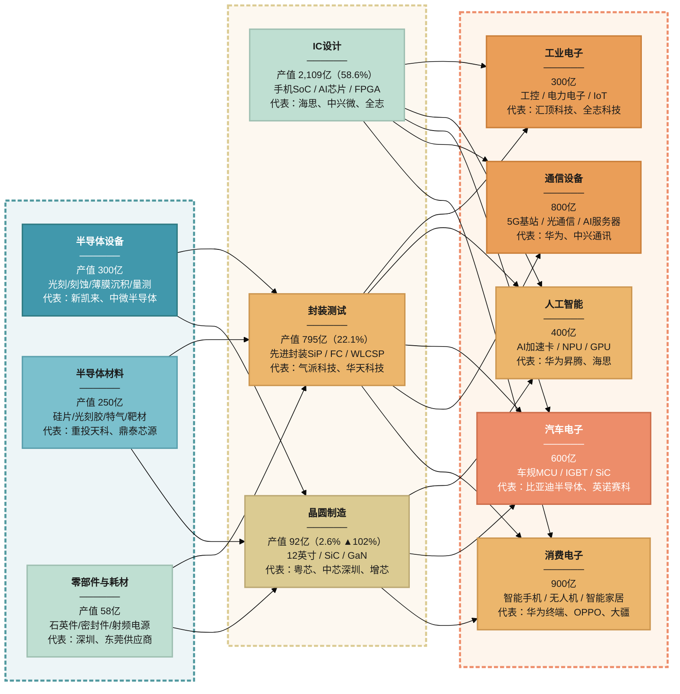

## 广东省集成电路产业链信息整理

> **数据来源：**
> - 中商产业研究院《2025年广东半导体与集成电路产业链全景图谱》（2025-02-11）
>   [https://m.askci.com/news/chanye/20250211/104829273924210960325264.shtml](https://m.askci.com/news/chanye/20250211/104829273924210960325264.shtml)
> - 深芯盟/深圳市半导体行业协会《深圳集成电路及国产半导体产业调研报告》（2025-10月发布）
>   [https://www.seccw.com/Document/detail/id/34188.html](https://www.seccw.com/Document/detail/id/34188.html) | 协会官网: [https://www.szsia.com](https://www.szsia.com)
> - 南方财经全媒体集团/21世纪经济报道《从买家到卖家，广东"芯"跳加速何以实现？》（2025-12-18）
>   [https://www.21jingji.com/article/20251218/herald/9e946b753d39f6f0a8d6049254f740f7.html](https://www.21jingji.com/article/20251218/herald/9e946b753d39f6f0a8d6049254f740f7.html)
> - 广东省统计局工业运行简况（2026年一季度）
>   [http://stats.gd.gov.cn/tjkx185/content/post_4887387.html](http://stats.gd.gov.cn/tjkx185/content/post_4887387.html)
> - 《广东省培育半导体及集成电路战略性新兴产业集群行动计划（2023-2025年）》（广东省工信厅）
>   [https://gdii.gd.gov.cn/zcgh3227/content/post_3096948.html](http://gdii.gd.gov.cn/)
> - 广东省情网《战略性新兴产业》
>   [http://dfz.gd.gov.cn/sqyl/gmjj/content/post_4886274.html](http://dfz.gd.gov.cn/sqyl/gmjj/content/post_4886274.html)
>
> ⚠ 部分 2026年数据为预测值，具体标注以"预计/估算/目标"字样标出。

---

### 一、产业链上下游分布

#### 1.1 产业链全景

| 产业链层级 | 主要环节 | 代表产品/技术 | 区域布局 | 代表企业 |
|-----------|---------|-------------|---------|---------|
| **上游：设备与材料** | 半导体设备 | 光刻机、刻蚀机、薄膜沉积、量测设备 | 深圳、珠海 | 新凯来、中微半导体、迈为技术 |
| | 半导体材料 | 硅片、光刻胶、电子特气、靶材、CMP材料 | 深圳、广州、珠海 | 重投天科(SiC衬底)、鼎泰芯源、广纳芯 |
| | 零部件与耗材 | 石英件、密封件、射频电源 | 深圳、东莞 | — |
| **中游：设计·制造·封测** | IC设计 | 手机芯片、AI芯片、IoT芯片、FPGA | 深圳南山(全国重镇)、珠海 | 海思半导体、中兴微电子、全志科技、汇顶科技、高云半导体 |
| | 晶圆制造 | 12英寸晶圆、SiC/GaN三代半 | 广州黄埔、深圳坪山 | 粤芯半导体、中芯深圳、增芯科技、芯粤能、鹏新旭、方正微电子 |
| | 封装测试 | 先进封装(SiP/FC)、传统封装 | 佛山、中山、深圳 | 气派科技、华天科技(深圳)、佛山华芯 |
| **下游：终端应用** | 消费电子 | 智能手机、无人机、智能家居 | 珠三角全域 | 华为、OPPO、vivo、大疆 |
| | 通信设备 | 5G基站、光通信、AI服务器 | 深圳、东莞 | 华为、中兴通讯 |
| | 汽车电子 | 车规MCU、IGBT、SiC功率器件 | 深圳、广州 | 比亚迪半导体、英诺赛科 |
| | 人工智能 | AI加速卡、NPU、GPU | 深圳、广州 | 华为昇腾、海思 |

> **来源：** 中商产业研究院《2025年广东半导体与集成电路产业链全景图谱》
> [https://m.askci.com/news/chanye/20250211/104829273924210960325264.shtml](https://m.askci.com/news/chanye/20250211/104829273924210960325264.shtml)

#### 1.2 中国60%芯片应用市场在珠三角

广东省是全球最大的电子信息产品制造基地，集成电路进口额常年占全国约**40%**，
同时60%的芯片应用市场集中在珠三角地区。"从买家到卖家"的转型是广东省"强芯工程"的核心目标。

> **来源：** 南方财经/21世纪经济报道（2025-12-18）
> [https://www.21jingji.com/article/20251218/herald/9e946b753d39f6f0a8d6049254f740f7.html](https://www.21jingji.com/article/20251218/herald/9e946b753d39f6f0a8d6049254f740f7.html)

---

### 二、核心环节产值与企业数量占比

#### 2.1 产业链各环节产值分布（2024年，总营收约3,600亿元）

| 产业链环节 | 产值（亿元） | 占比（%） | 同比增速 | 特征说明 |
|-----------|-------------|----------|---------|---------|
| **IC设计业** | 2,109 | 58.6% | ~25% | 传统优势环节，全国领先，深圳南山为全国IC设计重镇 |
| **封测业** | 795 | 22.1% | ~18% | 佛山、中山建有封测产业集群 |
| **装备与材料业** | 608 | 16.9% | ~15% | 设备国产化替代加速 |
| **晶圆制造业** | 92 | 2.6% | **102%** | 近年增长最快环节，多个12英寸线在建/量产 |
| **合计** | **~3,600** | **100%** | **~22%** | 产业链结构正从"偏科设计"转向"设计-制造-封测"铁三角 |

> **来源：** 深芯盟/深圳市半导体行业协会《深圳集成电路产业发展报告》（2025年10月发布，于2025中国（深圳）集成电路峰会公开）
> [https://www.seccw.com/Document/detail/id/34188.html](https://www.seccw.com/Document/detail/id/34188.html)
>
> 注：深芯盟报告口径为3,600亿元；中商产业研究院口径为"超3,200亿元"。差异可能来自统计范围不同。

#### 2.2 核心环节企业数量分布（深圳市数据，2024年，共727家）

| 产业链环节 | 企业数量（家） | 占比（%） | 较上年变化 |
|-----------|-------------|----------|----------|
| IC设计 | 456 | 62.7% | 数量最多，占比略降 |
| 设备及零部件 | 133 | 18.3% | 快速增长 |
| 封装测试 | 82 | 11.3% | 稳步增长 |
| 材料 | 48 | 6.6% | 稳步增长 |
| 晶圆制造 | 8 | 1.1% | 数量少但单个投资规模大 |
| **合计** | **727** | **100%** | — |

> **来源：** 深芯盟/深圳市半导体行业协会《深圳集成电路产业发展报告》（2025年10月发布）
> [https://www.seccw.com/Document/detail/id/34188.html](https://www.seccw.com/Document/detail/id/34188.html)
>
> 注：深圳占广东省IC产业总营收约79%，按此推算全省IC企业总数约为**900-1,000家**（含广州、珠海、东莞、佛山、中山等地）。

#### 2.3 研发/生产/销售 环节结构

| 功能环节 | 涉及产业链位置 | 产值占比估算 | 企业集中领域 |
|---------|-------------|------------|------------|
| **研发（设计）** | IC设计 + 材料研发 + 设备研发 | ~65% | 深圳（IC设计）、广州（材料研发）、珠海（IC设计） |
| **生产（制造+封测）** | 晶圆制造 + 封装测试 + 材料生产 | ~25% | 广州（晶圆制造）、佛山/中山（封测）、深圳（三代半） |
| **销售** | 全链条 | ~10% | 深圳（总部经济）、广州（商贸中心） |

> 注：研发/生产/销售占比为基于上述产业链环节数据推算的估算值。

---

### 三、企业类型分布（国企/民企/外企）

#### 3.1 关键说明

**⚠ 目前公开的统计年鉴和行业报告中，未披露广东省集成电路产业按所有制（国企/民企/外企）划分的精确企业数量与产值占比数据。** 下表是基于公开代表企业信息整理的结构化估算，标注为"估算"的项目请在使用时注明数据局限性。

**建议精确数据获取途径：**
1. 《广东统计年鉴2025》"高技术制造业"章节，查阅按登记注册类型分组的细分数据 — [http://stats.gd.gov.cn/tjkx185/content](http://stats.gd.gov.cn)
2. 中国半导体行业协会（CSIA）年度产业报告
3. 深芯盟/深圳市半导体行业协会完整版年度报告（当前仅公开摘要） — [https://www.szsia.com](https://www.szsia.com)

#### 3.2 企业类型分布估算

| 企业类型 | 估算企业数量占比 | 估算产值占比 | 主要分布领域 | 代表企业 |
|---------|---------------|-----------|------------|---------|
| **民营企业** | ~75-80% | ~55-60% | IC设计、设备、材料、封测 | 海思半导体、中兴微电子、粤芯半导体、比亚迪半导体、全志科技、汇顶科技、天域半导体、增芯科技、鹏新旭、高云半导体 |
| **国有企业/国有控股** | ~10-15% | ~20-25% | 晶圆制造、关键材料 | 华润微(润鹏半导体)、广晟集团(国星光电)、中国电子(部分子公司)、方正微电子 |
| **外资/合资企业** | ~5-10% | ~15-20% | 晶圆制造、高端封测、设备 | 中芯国际(深圳)、英诺赛科(珠海)、部分封测代工厂 |
| **合计** | **~100%** | **~100%** | — | — |

> **推算逻辑说明：**
> - **民营企业占比高**：广东省尤其是深圳的IC设计产业全国领先，而IC设计行业以民营企业为主体（海思、中兴微、汇顶等），IC设计产值占全省IC总产值的58.6%；
> - **国企在制造端占比较高**：晶圆制造单个项目投资大（百亿级），国有资本参与度高（华润微、粤芯亦有国资背景）；
> - **外企占比相对低**：受限于贸易管制和技术封锁，外资在华/在粤集成电路制造布局有限。
>
> 本估算交叉参考了证券之星《2022年广东省集成电路企业大数据全景分析》的企业竞争格局数据：
> [https://wap.stockstar.com/detail/IG2022090600002689](https://wap.stockstar.com/detail/IG2022090600002689)

#### 3.3 代表企业按类型细分

| 企业名称 | 企业类型 | 产业链环节 | 所在城市 | 2024年营收或估值参考 |
|---------|---------|-----------|---------|-------------------|
| 海思半导体 | 民企 | IC设计 | 深圳 | 未公开(华为体系内) |
| 中兴微电子 | 民企 | IC设计 | 深圳 | 未公开(中兴体系内) |
| 粤芯半导体 | 民企(含国资背景) | 晶圆制造 | 广州 | 估值约160亿元，拟A股上市 |
| 比亚迪半导体 | 民企 | 功率半导体/IDM | 深圳 | 百亿级(比亚迪体系) |
| 中芯国际(深圳) | 外资/合资 | 晶圆制造 | 深圳 | 中芯国际体系内 |
| 润鹏半导体 | 国企/华润微 | 晶圆制造 | 深圳 | 十二英寸线在建 |
| 全志科技 | 民企 | IC设计 | 珠海 | 上市公司 |
| 汇顶科技 | 民企 | IC设计 | 深圳 | 上市公司 |
| 天域半导体 | 民企 | SiC外延 | 东莞 | 拟港股上市 |
| 英诺赛科 | 民企/外资 | GaN/IDM | 珠海 | 港股上市公司 |
| 国星光电 | 国企/广晟集团 | LED/光电器件 | 佛山 | 上市公司 |
| 气派科技 | 民企 | 封装测试 | 深圳 | 上市公司 |

> **来源：** 各企业上市公司公告/招股书、中商产业研究院《2025年广东半导体与集成电路产业链全景图谱》
> [https://m.askci.com/news/chanye/20250211/104829273924210960325264.shtml](https://m.askci.com/news/chanye/20250211/104829273924210960325264.shtml)

---

### 四、产业区域布局（"3+N"格局）

| 城市 | 定位 | 产业规模参考 | 重点产业园区 | 核心特征 |
|------|------|-----------|------------|---------|
| **深圳** | 绝对核心 | 营收2,839.6亿元(占全省79%)，企业727家 | 坪山集成电路产业园、南山科技园 | 全产业链优势，IC设计全国前三，发力晶圆制造 |
| **广州** | 核心城市 | 黄埔区集聚企业超150家 | 广州开发区(黄埔)、增城开发区、南沙新区 | 粤芯半导体所在地，"一核两极多点"布局 |
| **珠海** | 核心城市 | IC设计珠三角第二，高新区规上232亿元 | 珠海高新区半导体与集成电路产业园(省级特色产业园) | 化合物半导体"五料俱全"(GaN/SiC/InP/GaAs/GaSb) |
| **东莞** | 协同发展 | — | 松山湖高新区 | 封装测试、第三代半导体(SiC外延) |
| **佛山** | 协同发展 | — | 佛山高新区 | 封测产业集群、LED光电器件 |
| **中山** | 协同发展 | — | 火炬开发区(省级特色产业园) | 集成电路及电子元器件 |
| **惠州** | 协同发展 | — | 仲恺高新区 | 电子元器件协同配套 |

> **来源：**
> - 南方网《广东构建半导体及集成电路产业"3+N"布局》
>   [https://news.southcn.com/node_d75048eff3/5f6ba8926e.shtml](https://news.southcn.com/node_d75048eff3/5f6ba8926e.shtml)
> - 凤凰网《省级特色产业园名单公布，珠海高新区半导体与集成电路产业园独家入选》
>   [https://gd.ifeng.com/c/8mSJ8ZwUP8s](https://gd.ifeng.com/c/8mSJ8ZwUP8s)
> - 广州日报《广州打造国家集成电路产业发展"第三极"核心承载区》（2025-02-20）
>   [https://news.dayoo.com/guangzhou/202502/20/139995_54789207.htm](https://news.dayoo.com/guangzhou/202502/20/139995_54789207.htm)
> - 中新网《广东这样打造"中国芯"第三极》（2024-06-03）
>   [https://www.chinanews.com/cj/2024/06-03/10227829.shtml](https://www.chinanews.com/cj/2024/06-03/10227829.shtml)
> - 珠海高新区官网《打造国内领先的化合物半导体与特色工艺产业化示范区》
>   [https://www.zhuhai-hitech.gov.cn/gxxw/gxdt/content/post_3832668.html](https://www.zhuhai-hitech.gov.cn/gxxw/gxdt/content/post_3832668.html)

---

### 五、2024-2026年核心指标

| 指标 | 2024年 | 2025年 | 2026年(预测/快报) |
|------|--------|--------|-----------------|
| 集成电路产量(亿块) | 804 | 预计~950 | 一季度增速43.1%, 预计达1,200+ |
| 产业营收(亿元) | ~3,200-3,600 | ~4,000(目标) | 预计4,500-5,000 |
| 12英寸晶圆月产能(万片) | 突破10 | 预计15-20 | 预计25-30 |
| IC设计业产值(亿元) | ~2,109 | ~2,600 | ~3,200+ |
| 晶圆制造业产值(亿元) | ~92 | ~180(估算) | ~350+(估算) |

> **来源：**
> - 广东省统计局 2024年工业运行数据: [http://stats.gd.gov.cn/fhygy/](http://stats.gd.gov.cn/fhygy/)
> - 广东省统计局 2026年一季度工业运行简况: [http://stats.gd.gov.cn/tjkx185/content/post_4887387.html](http://stats.gd.gov.cn/tjkx185/content/post_4887387.html)
> - 广东省工信厅《培育半导体及集成电路战略性新兴产业集群行动计划（2023-2025年）》: [http://gdii.gd.gov.cn/](http://gdii.gd.gov.cn/)
> - 深芯盟《深圳集成电路及国产半导体产业调研报告》（2025年10月）: [https://www.seccw.com/Document/detail/id/34188.html](https://www.seccw.com/Document/detail/id/34188.html)
> - 2024年产量数据亦见：深圳市半导体与集成电路产业联盟报道 [https://www.szsica.com/zcyd/87](https://www.szsica.com/zcyd/87)

---

### 六、数据缺口与建议补充途径

| 缺失数据 | 建议获取方式 |
|---------|------------|
| 国企/民企/外企精确数量与产值占比 | 《广东统计年鉴2025》按登记注册类型分组表 ([http://stats.gd.gov.cn](http://stats.gd.gov.cn))；CSIA年度报告；深芯盟完整版报告 ([https://www.szsia.com](https://www.szsia.com)) |
| 广东省全省IC企业总数（精确值） | 广东省市场监管局企业注册数据（可按行业代码筛选）；企查查/天眼查高级搜索 |
| 2026年完整年度数据 | 关注2026年7月前后发布的《2025年广东省半导体与集成电路产业发展报告》 |
| 研发投入占比、专利数量 | 广东省知识产权保护中心《广东省半导体及集成电路产业专利统计分析报告》 — [https://www.gippc.com.cn/ippc/zscqxxts/202208/](https://www.gippc.com.cn/ippc/zscqxxts/202208/) |
| 细分领域（三代半、先进封装等）产值 | 中商产业研究院付费版深度报告 ([https://m.askci.com](https://m.askci.com))；前瞻产业研究院 ([https://www.qianzhan.com](https://www.qianzhan.com)) |

---

### 七、原始数据源汇总

| # | 来源 | 链接 | 说明 |
|---|------|------|------|
| 1 | 中商产业研究院 | [https://m.askci.com/news/chanye/20250211/104829273924210960325264.shtml](https://m.askci.com/news/chanye/20250211/104829273924210960325264.shtml) | 2025年广东半导体与集成电路产业链全景图谱 |
| 2 | 深芯盟/深圳市半导体行业协会 | [https://www.seccw.com/Document/detail/id/34188.html](https://www.seccw.com/Document/detail/id/34188.html) | 深圳集成电路及国产半导体产业调研报告（2025年10月） |
| 3 | 深圳市半导体行业协会 | [https://www.szsia.com](https://www.szsia.com) | 会员名单、行业发展报告 |
| 4 | 21世纪经济报道 | [https://www.21jingji.com/article/20251218/herald/9e946b753d39f6f0a8d6049254f740f7.html](https://www.21jingji.com/article/20251218/herald/9e946b753d39f6f0a8d6049254f740f7.html) | 从买家到卖家：广东"芯"跳加速何以实现（2025-12-18） |
| 5 | 广东省统计局 | [http://stats.gd.gov.cn/tjkx185/content/post_4887387.html](http://stats.gd.gov.cn/tjkx185/content/post_4887387.html) | 2026年一季度工业运行简况 |
| 6 | 广东省统计局（工业数据首页） | [http://stats.gd.gov.cn/fhygy/](http://stats.gd.gov.cn/fhygy/) | 工业运行月度数据 |
| 7 | 广东省工信厅 | [http://gdii.gd.gov.cn/](http://gdii.gd.gov.cn/) | 专精特新企业名单、产业行动计划 |
| 8 | 广东省情网 | [http://dfz.gd.gov.cn/sqyl/gmjj/content/post_4886274.html](http://dfz.gd.gov.cn/sqyl/gmjj/content/post_4886274.html) | 广东年鉴2025·战略性新兴产业 |
| 9 | 南方网 | [https://news.southcn.com/node_d75048eff3/5f6ba8926e.shtml](https://news.southcn.com/node_d75048eff3/5f6ba8926e.shtml) | 广东构建半导体及集成电路产业"3+N"布局 |
| 10 | 中新网 | [https://www.chinanews.com/cj/2024/06-03/10227829.shtml](https://www.chinanews.com/cj/2024/06-03/10227829.shtml) | 广东这样打造"中国芯"第三极（2024-06-03） |
| 11 | 羊城晚报 | [https://money.ycwb.com/2024-06/03/content_52725623.htm](https://money.ycwb.com/2024-06/03/content_52725623.htm) | 2700亿元！广东十大战略性新兴产业"新质"观（2024-06-03） |
| 12 | 珠海高新区 | [https://www.zhuhai-hitech.gov.cn/gxxw/gxdt/content/post_3832668.html](https://www.zhuhai-hitech.gov.cn/gxxw/gxdt/content/post_3832668.html) | 打造国内领先的化合物半导体与特色工艺产业化示范区 |
| 13 | 凤凰网广东 | [https://gd.ifeng.com/c/8mSJ8ZwUP8s](https://gd.ifeng.com/c/8mSJ8ZwUP8s) | 省级特色产业园名单公布，珠海高新区IC产业园独家入选 |
| 14 | 广州日报 | [https://news.dayoo.com/guangzhou/202502/20/139995_54789207.htm](https://news.dayoo.com/guangzhou/202502/20/139995_54789207.htm) | 广州打造国家集成电路产业发展"第三极"核心承载区（2025-02-20） |
| 15 | 深圳市半导体与集成电路产业联盟 | [https://www.szsica.com/zcyd/87](https://www.szsica.com/zcyd/87) | 广东两会：2024年广东集成电路产量增长21%、占全国18% |
| 16 | 广州市半导体协会 | [http://www.gzsia.net.cn/cybg](http://www.gzsia.net.cn/cybg) | 产业报告 |
| 17 | 广州市统计局 | [https://tjj.gz.gov.cn/datav/admin/home/ndsj/](https://tjj.gz.gov.cn/datav/admin/home/ndsj/) | 广州统计信息手册（2025年） |
| 18 | 广东省知识产权保护中心 | [https://www.gippc.com.cn/ippc/zscqxxts/202208/](https://www.gippc.com.cn/ippc/zscqxxts/202208/) | 广东省半导体及集成电路产业专利统计分析报告 |
| 19 | 广东省集成电路行业协会 | [https://www.gdica.net.cn/](https://www.gdica.net.cn/) | 会员之窗-协会会员 |
| 20 | 证券之星 | [https://wap.stockstar.com/detail/IG2022090600002689](https://wap.stockstar.com/detail/IG2022090600002689) | 2022年广东省集成电路企业大数据全景分析 |
| 21 | 广东省工信厅-专精特新 | [https://gdii.gd.gov.cn/zwgk/tzgg1011/content/post_4856034.html](https://gdii.gd.gov.cn/zwgk/tzgg1011/content/post_4856034.html) | 2025年广州市专精特新中小企业认定（复核）公示名单 |
| 22 | 广东省工信厅-专精特新复核 | [https://gdii.gd.gov.cn/zwgk/tzgg1011/content/post_4851686.html](https://gdii.gd.gov.cn/zwgk/tzgg1011/content/post_4851686.html) | 2025年通过复核专精特新中小企业名单 |

---

*本报告由 Python 脚本 `code_files/scrape_ic_data.py` 自动生成。*
*生成时间：2026-05-08 13:10:04*
*数据截止日期：2026年5月8日（公开可得的最新数据）*

