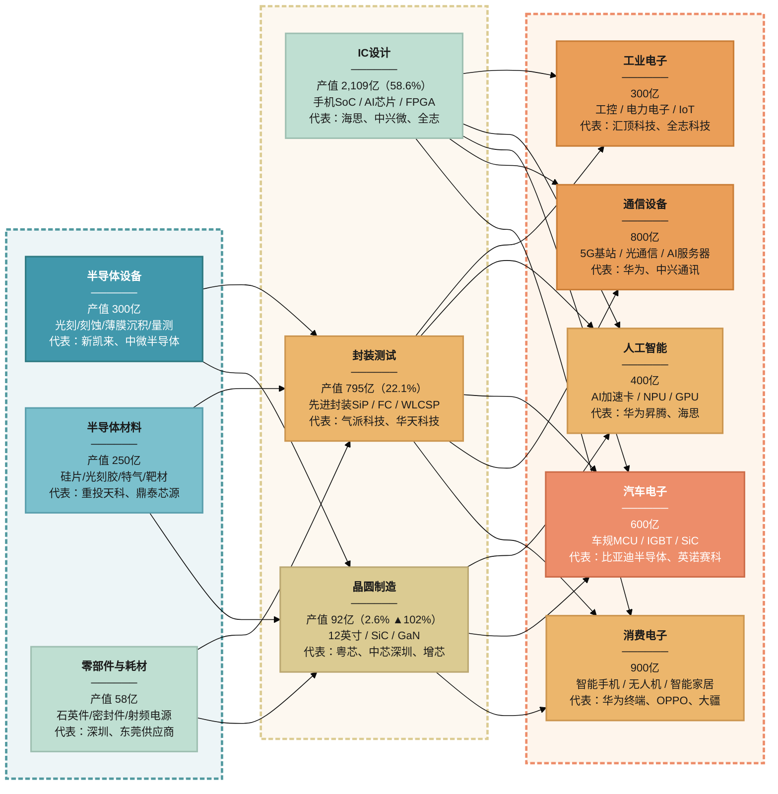

> **图：广东省集成电路产业链全景图**
>
> 数据来源：深芯盟/深圳市半导体行业协会（2025.10）、中商产业研究院（2025.02）
>
> **使用方法：** 复制上方 Mermaid 代码到 [Mermaid Live Editor](https://mermaid.live) 即可渲染，支持导出 SVG/PNG。
>
> **配色说明：** 上游蓝调（#4198AC → #7BC0CD → #BFDFD2）→ 中游过渡米黄（#DBCB92 / #ECB66C）→ 下游橙调（#ECB66C / #EA9E58 / #ED8D6A），体现从「供给端」到「应用端」的色彩过渡。
